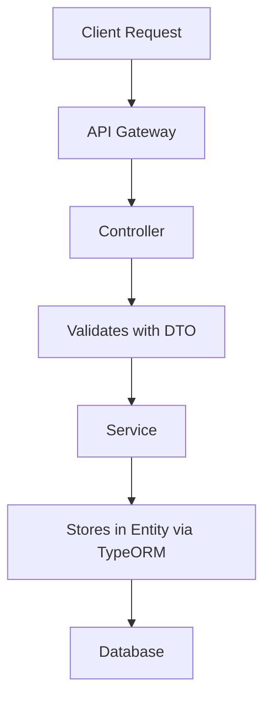

# About

This repository is just a playground for me to explore NestJs framework with my friends.

## Request Flow



## Host Mapping

```cmd
  echo 127.0.0.1 localhost nest-poc.com >> C:\Windows\System32\Drivers\etc\hosts

  echo ::1 localhost nest-poc.com >> C:\Windows\System32\Drivers\etc\hosts
```
